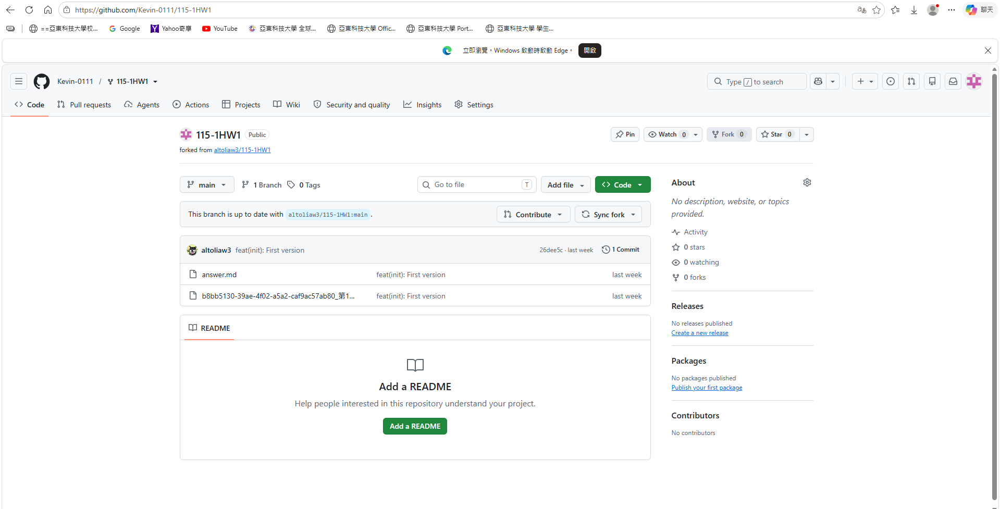
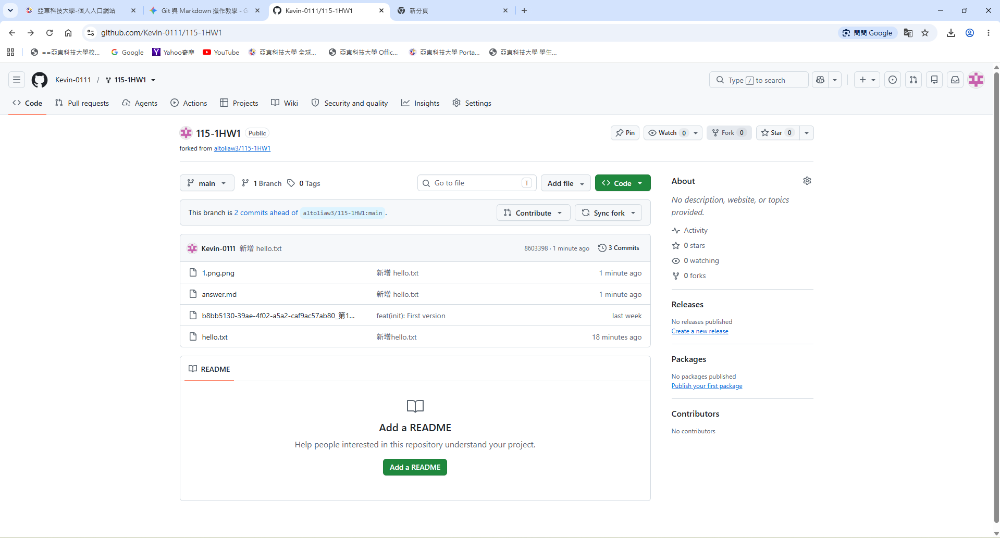
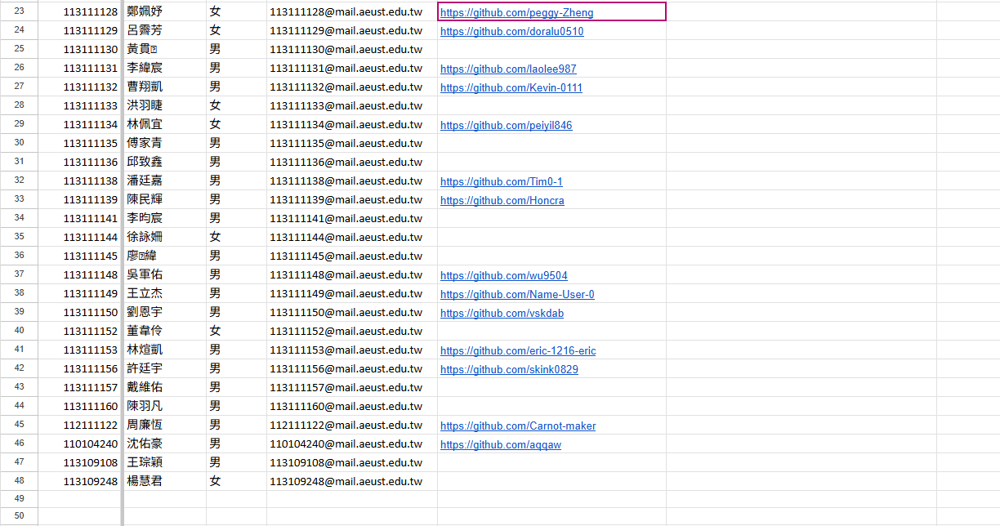

# 第1次作業題目-隨堂-HW1
>
>學號：113111132 
><br />
>姓名：曹翔凱 
><br />
>作業撰寫時間：180 mins
><br />
>最後撰寫文件日期：2026/10/01 
>

本份文件包含以下主題：(至少需下面兩項，若是有多者可以自行新增)
- [x] 說明內容
- [x] 其他 (可以包含心得或是想跟老師反映)

## 說明內容


1. Ans:請參閱
Topic 0
的
  git clone 
該⾴
(P. 12)
中，看完
fork
內容後，請完成⽼師倉庫的
fork
，截圖並說明如何完成。




2. Ans:請研究
markdown
基本寫作⽅法，並請對常⾒語法進⾏介紹後，請給個例⼦

常用 Markdown 語法介紹

- **標題 (Headers)**：使用 `#` 到 `######` 表示一級至六級標題。
   * 範例：`# 一級標題`
- **粗體與斜體 (Bold & Italic)**：使用 `**` 包覆粗體，`*` 包覆斜體。
   * 範例：`**粗體文字**`、`*斜體文字*`
- **無序與有序清單 (Lists)**：無序清單使用 `-` 或 `*`，有序清單使用數字加點 `1.`。
   * 範例：
     - 項目一
     - 項目二
- **程式碼區塊 (Code Block)**：使用三個反單引號包覆程式碼。
   * 範例：
     ```python
     print("Hello World")
     ```
- **圖片與連結 (Images & Links)**：
   * 連結語法：`[顯示文字](URL)` * 圖片語法：``

3. 
Ans:請在你的專案中完成下⾯的操作，最後把結果推上
 GitHub
，並截圖
 git graph 
說
明你的做法。步驟如下：
i
ii
建⽴新分⽀
從
main 
分⽀建⽴⼀條新分⽀，名稱⾃訂（例如
 feature
你的學號），並切換
到這條新分⽀。
在新分⽀上新增檔案並寫⼊內容
在新分⽀上新增⼀個檔案（例如
 hello.txt
），內容⾄少包含：
1
第1次作業題⽬-作業-HW1
Hello Git!
姓名：（你的姓名）
學號：（你的學號）
iii
提交（
commit
）
把新增的檔案加⼊暫存區，再進⾏
 commit
，
commit 
訊息要能說明這次做了
什麼（例如「新增
 hello.txt
」）。
iv
合併（
merge
）
切回
 main 
分⽀，把剛剛的新分⽀合併進
 main





4. Ans:
請於「點我」找到⾃⼰的名字後，並於對應的「
github
帳號位址
 [
請撰寫
]
」欄位
中，貼上網址，其網址規則要貼的內容為：
i
ii
iii
於
github
右上⾓點選⾃⼰的圖⽰並選擇「
profile
」，如下圖所⽰：
複製「進⼊
 profile
後的網址列」，並填⼊「
github
帳號位址
 [
請撰寫
]
」欄位
中。
截圖寫⼊結果並放⼊
answer.md
的
4
中


## 其他   這堂課一開始都不知道要怎麼用，經過查詢網路的教學和跟同學一起弄、一起解決困難後，漸漸理清了流程並順利上手。不僅提升了自己解決問題的能力，也深刻體會到同學間互相幫忙的效率。